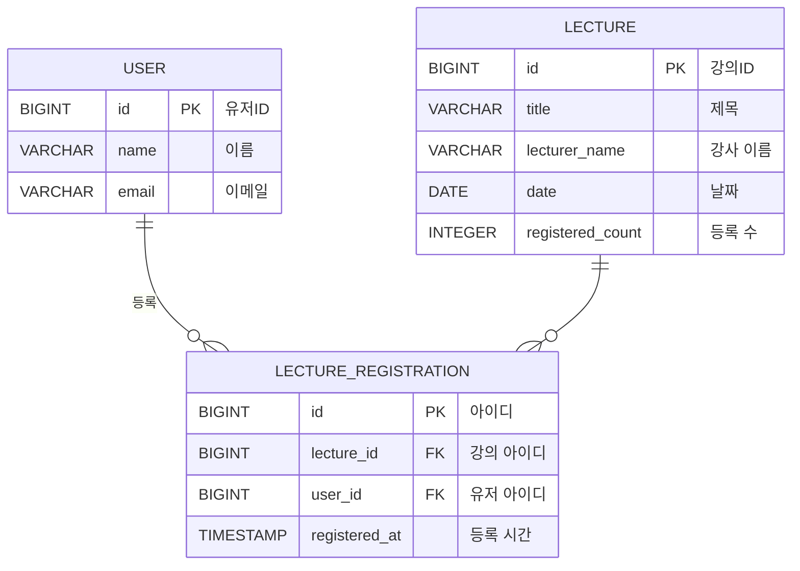

## 1. ERD 설계

 
위와 같이 요구사항에 맞게 총 3개의 테이블을 작성했습니다. 

- **`USER`** 테이블:
    - 유저의 기본 정보를 저장합니다. 각 유저에 대한 ID, 이름, 이메일을 가지고 있습니다.
- **`LECTURE`** 테이블:
    - 강의에 대한 정보를 저장합니다. 각 강의에 대한 ID, 강의 제목, 강사 이름, 강의 날짜, 현재 등록된 인원 수를 가지고 있습니다.
- **`LECTURE_REGISTRATION`** 테이블:
    - `USER`와 `LECTURE` 간의 강의 등록에 관한 관계 테이블 입니다. 이 테이블은 유저가 특정 강의를 등록할 때 정보를 저장하며, 유저 ID와 강의 ID를 외래 키로 참조합니다. 또한 중복 방지를 위해 lecture_id와 user_id를 유니크 키로 설정하여 동일한 유저가 동일한 강의를 여러 번 등록하는 것을 데이터베이스 레벨에서도 방지하도록 했습니다.

 

처음에는 등록 요청이 올 때마다 해당 강의 ID로 `LECTURE_REGISTRATION` 테이블에서 `COUNT(*)` 쿼리를 통해 현재 등록된 수를 확인하려고 했습니다. 하지만 강의 등록 테이블의 데이터 양이 많아지거나 동시 요청이 많아질 경우, 조회 성능이 저하될 뿐만 아니라 락을 걸 경우 더 느려질 수 있어 효율적이지 못한 로직이라 생각되었습니다.

그래서 애플리케이션 레벨에서 트랜잭션 처리와 데이터베이스 락을 적절히 수행하여 강의 테이블의 `registered_count` 값이 `LECTURE_REGISTRATION` 테이블의 Count 수와 일치하게 증가하도록 구조를 변경하였습니다. 이로 인해 현재 등록된 수를 더 쉽게 반환할 수 있게 되었습니다.

 

## 2. 데이터베이스 락의 필요성

단일 서버의 경우 여러 인스턴스가 동시에 접근할 때 애플리케이션 레벨에서 락을 설정하여 동시성 처리가 가능합니다. 그러나 분산 서버 환경까지 고려했을 때에는 애플리케이션 레벨의 동시성 처리가 어려워질 수 있습니다. 따라서 공유 자원인 데이터베이스에서 락을 활용해 동시성을 제어하는 설정이 필요합니다.

  

## 3. DB 락을 활용한 동시성 제어 기법

### 1. 낙관적 락 **(Optimistic Lock)**

- 낙관적 락은 기본적으로 데이터에 락을 걸지 않고, 트랜잭션이 완료될 때까지 다른 트랜잭션이 해당 데이터를 수정하지 않을 것이라고 가정합니다.
- `version`을 이용하여 읽을 때와 쓸 때의 정합성을 확인하고 맞다면 업데이트를 수행합니다.
- 만약 `version`이 맞지 않다면 예외가 발생하여 트랜잭션이 실패하게 됩니다.

### 2. 비관적 락 **(Pessimistic Lock)**

- 비관적 락은 데이터에 대한 접근이 이루어질 때 항상 락을 걸고, 다른 트랜잭션이 해당 데이터를 접근하지 못하도록 막습니다.
- 다른 사용자는 먼저 접근한 사용자가 변경 사항을 커밋하고 레코드 잠금을 해제할 때까지 기다려야 합니다.

  

## 4. 비관적 락을 선택한 이유

비관적 락을 선택한 이유는 낙관적 락이 선착순에 대한 보장을 제공하지 못하기 때문입니다. 낙관적 락은 레코드 락을 걸지 않음으로써 오버헤드를 줄일 수 있는 장점이 있으나, 업데이트 시 버전이 맞지 않으면 트랜잭션이 실패하고 다시 시도해야 하며, 이로 인해 순차적인 보장이 어려워집니다. 반면, 비관적 락은 대기열에서 순차 보장을 제공하므로, 여러 사용자가 동시에 요청할 경우에도 데이터의 일관성을 유지할 수 있습니다.